# LabVIEW Program for Pressure and Resistance Measurement

This guide explains how to use the `Lab1.0.vi` LabVIEW program to measure resistance and pressure using an LCR meter and a force measurement device.

---

## Chapter 1: Preparation

### Step 1: Power on all measurement devices
Ensure that both the LCR meter and the force measurement device are powered on and properly connected to the PC via USB or serial interface.

---

### Step 2: Launch NI MAX

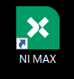

Open **NI Measurement & Automation Explorer (NI MAX)** on your PC.

---

### Step 3: Click “Devices and Interfaces” and wait for detection

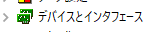

In NI MAX, click on the left-side menu **Devices and Interfaces**. Wait for all connected hardware to be detected.

---

### Step 4: Confirm connections and note VISA names or COM ports
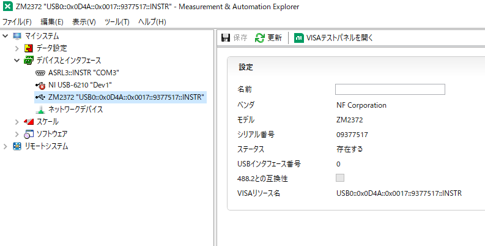

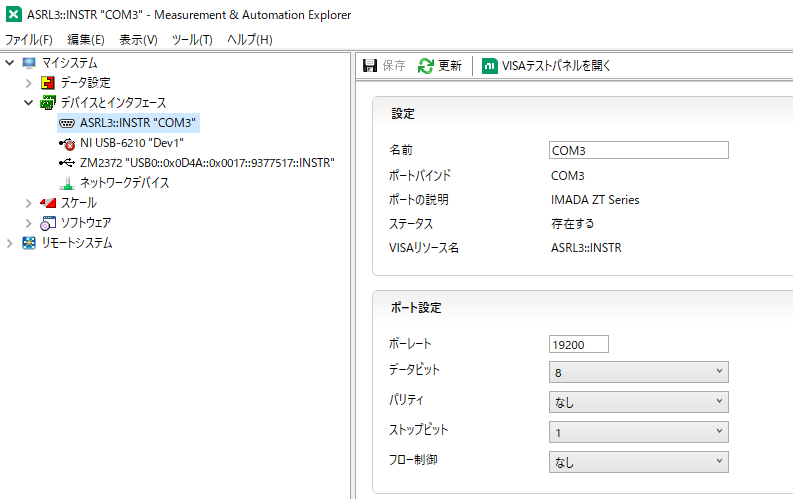

Ensure both the LCR meter and force measurement device are listed. Note their respective VISA resource names (e.g., `USB0::0xXXXX::...`) or COM port numbers (e.g., `COM3`).

---

## Chapter 2: Measurement

### Step 1: Open `Lab1.0.vi`
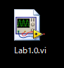

Launch LabVIEW and open the file named `Lab1.0.vi`.

---

### Step 2: If prompted, click “Run”

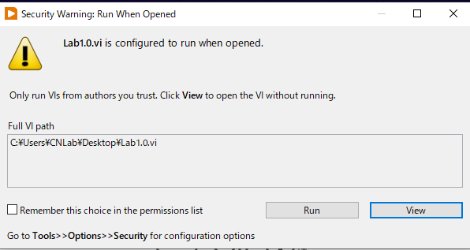

If LabVIEW shows a warning or dialog, click the **Run** button to start the VI.

---

### Step 3: Main interface

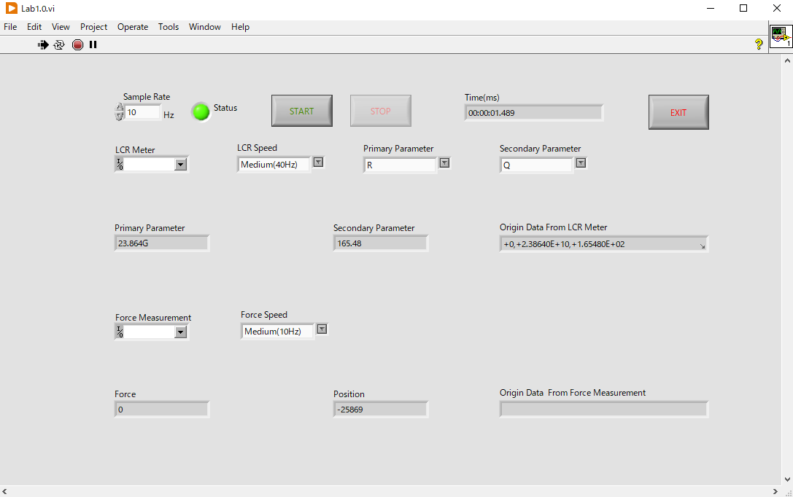

The main interface contains:
- Device selection dropdowns
- Parameter settings (frequency, sample count, etc.)

---

### Step 4: Select the correct VISA names or COM ports

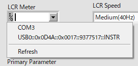

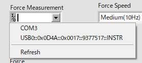

From the dropdown lists, select the appropriate VISA resource or serial port for the LCR meter and the force measurement device.

---

### Step 5: Set measurement parameters (cannot be changed after starting)

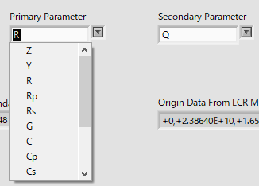

In the main interface, you can select the **Primary Parameter** and **Secondary Parameter** for measurement using the dropdown menus.

Below is a brief description of the common parameters:

- `Z` – **Impedance** (magnitude of the total complex impedance)
- `Y` – **Admittance** (inverse of impedance)
- `R` – **Resistance** (real part of impedance)
- `Rp` – **Parallel resistance**
- `Rs` – **Series resistance**
- `G` – **Conductance** (inverse of resistance)
- `C` – **Capacitance**
- `Cp` – **Parallel capacitance**
- `Cs` – **Series capacitance**
- `Q` – **Quality factor**
- `D` – **Dissipation factor**

> 📘 *For more detailed definitions and appropriate usage of these parameters, please refer to the official user manual of your LCR meter.*

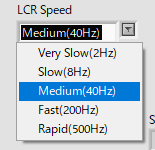
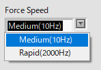

The connected devices (such as the LCR meter and force measurement unit) offer a set of **predefined sampling frequencies**.  
These frequencies **cannot be customized manually**, so you must select from the available options.

- It is recommended to choose a sampling frequency that is **slightly higher than your target rate**.
- ⚠️ Avoid unnecessarily high frequencies, as they may introduce noise or increase CPU load without improving data quality.

> 📘 *Please refer to your device's official documentation for the exact list of supported sampling frequencies.*

⚠️ **These settings are locked once measurement begins.**

---

### Step 6: Click “START” to begin and select data save path

Before starting the measurement, set the **software sampling frequency** in the corresponding input box.  
This defines how often the program polls data from the connected devices.

⚠️ **Important:**  
If the software sampling frequency is **higher than the actual data update rate of the device**, duplicated values may occur in the recorded data.  
Make sure the sampling frequency is properly configured based on your device’s performance and output interval.

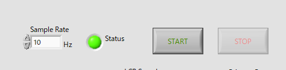

Click the **START** button to begin the measurement. You will be prompted to choose a file path to save the output CSV file.

---

### Step 7: Click “STOP” to end the measurement

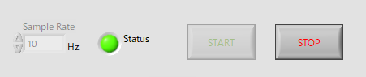

⚠️ **Important:** Always click the **STOP** button to end the measurement before closing the program.  
Failing to do so may cause the devices to hang or become unresponsive.

---

## Chapter 3: Notes

- If a software error occurs during operation, click **"Continue"** to proceed.If the error persists, please click **"Stop"** use **NI MAX** to check whether the devices are properly connected and recognized by the system.
- If the program crashes or is interrupted due to an error:**Close and restart the program completely.**

⚠️ **Important:** Since this program was developed using the LabVIEW Community Edition, continuing execution after an error may enter **edit mode**, where accidental changes to the block diagram can occur. Please avoid making any modifications unless you are debugging intentionally.
- If you encounter any bugs or have feature requests, please feel free to contact **YU**.

---

## License

This LabVIEW program is provided for research and academic use. For commercial licensing, please contact the author.

---
